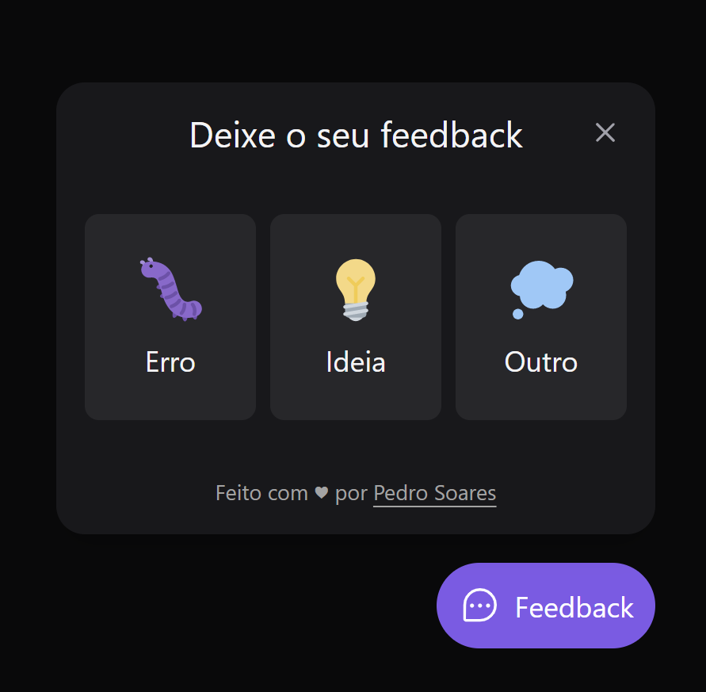

# RocketSeat | Next Level Week Return | Impulse team

[Next Level Week](https://nextlevelweek.com) is a yearly event created by [RocketSeat](https://www.rocketseat.com.br/sobre).

The goal of this event is to teach and share knowledge about frontend, backend and mobile applications.

The tech stack that they use the most is React, React Native and Node.

This year, we created a widget to allow the users to send feedback.
This repository contains the web user interface of the widget.



# Layout

You can find the layout of this project [in this link](https://www.figma.com/community/file/1102912516166573468).

You must create an account to access and view.

# Improvements checklist

- [ ] Change email service to a production one
- [ ] Improve email HTML + CSS
- [ ] Add parameters and algorithms validation
    - [ ] Handle error
    - [ ] Display user friendly message

# Technologies

- [TypeScript](https://www.typescriptlang.org/docs/)
- [Node](https://nodejs.org/en/docs/)
- [Prisma](https://www.prisma.io/docs/)
- [Express](https://expressjs.com/en/starter/installing.html)
- [Jest](https://jestjs.io/docs/getting-started)

# Setup

## Clone repository

Create and go to the directory where you want to place the repository

```bash
  cd my-directory
```

Clone the project

```bash
  git clone https://github.com/pncsoares/nlw-return-impulse-server.git
```

Go to the project directory

```bash
  cd nlw-return-impulse-server
```

## Start the server

Open terminal and execute the following command:

```bash
  npm run dev
```

## Run tests

Open terminal and execute the following command:

```bash
  npm run test
```

# License

MIT